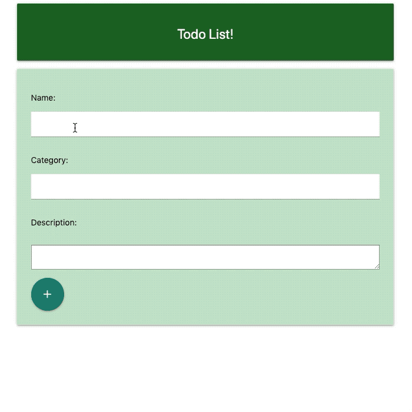

## About

This is a basic todo application that had a deadline of two days to get a minimum viable product. 

# Tech Stack 

## Technologies

<table style="width:60%">
  <tr>

  </tr>
  <tr>
    <td class="subheading">Frontend</td>
    <td></td> 
    <td></td>
    <td></td>
    <td class="tech">(React Redux Materialize)</td>
  </tr>
  <tr rowspan="2">
    <td class="subheading">Backend</td>
    <td></td> 
    <td></td>
    <td></td>
    <td class="tech">(Node Express)</td>
  </tr>
  
  <tr>
      <td class="subheading">Dev Tools</td>
      <td></td>
      <td></td>
      <td></td>
      <td class="tech">(Webpack Babel)</td>
    </tr>  
</table>

### Technical Challenges/Research

## Minimum Viable Product (MVP)

# How to run
/root
pipenv shell
/app
python manage.py runserver

localhost:8000
